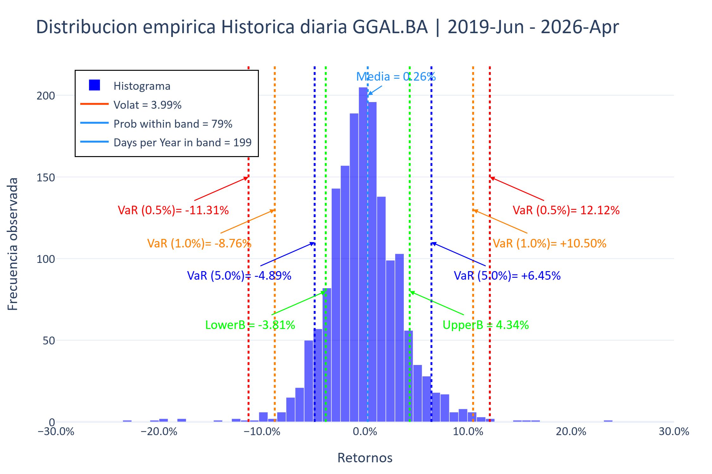

# Market Risk Analysis — VaR & GARCH

<p>
  
  
  
</p>

Quantitative market risk analysis using multiple VaR methodologies and GARCH volatility modeling, applied to **GGAL** (Grupo Financiero Galicia) from mid-2000 to present — covering more than two decades of Argentine market history, including some of the most severe financial crises in the country's history.

> Although this project focuses on GGAL, the methodology is fully transferable to any financial asset.

---

## Overview

This project estimates and validates the **Value at Risk (VaR)** of a financial asset using five different approaches, each with distinct assumptions about return distributions and volatility behavior. It also performs **backtesting** to compare VaR estimates against actual price movements, assessing the statistical validity of each model.

A key feature is the integration of **relevant macroeconomic and political events** in Argentina, mapped directly onto the charts — allowing a clear visual understanding of how external shocks impacted asset behavior and model performance.

---

## What this project does

- Computes VaR using **five methodologies:**
  - Normal (Gaussian) distribution
  - Student's t-distribution
  - Historical simulation
  - Monte Carlo simulation
  - GARCH-based dynamic volatility
- Displays the **mathematical formulas and step-by-step calculations** for each method
- Compares **multiple volatility estimates** side by side (simple, exponential, GARCH)
- Performs **backtesting:** actual returns vs. VaR estimates over time
- Visualizes **return distributions** with empirical probability ranges
- Studies **return percentiles, streaks, and state transitions** — up/down/zero-day counts, runs of consecutive up or down days, and the probability of one day's direction carrying into the next
- Tracks **exceedances** — counting how often actual losses exceeded the VaR threshold
- Maps **key historical events** (political crises, devaluations, economic shocks) directly on the charts

---

## Key context: why GGAL from 2000?

The dataset starts one year before Argentina's **2001 financial crisis** — one of the largest sovereign defaults in history. This was followed by decades of recurring crises, currency devaluations, capital controls, and extreme volatility events (including the 2018 currency crash and the 2019 PASO election shock).

This makes GGAL an exceptionally demanding test case for risk models — far more challenging than assets from stable markets.

---

## Preview



---

## Results & outputs

- 📊 **Interactive Bloomberg-style charts** (Plotly) showing:
  - Historical price and returns
  - VaR estimates over time for each methodology
  - Actual return vs. VaR comparison (backtesting view)
  - Return distribution with empirical probability ranges at 1-day horizon
  - Volatility comparison across methods
- 📋 **Summary tables** with:
  - VaR values by method and confidence level
  - Exceedance counts and percentages
  - Return percentile breakdown
  - Streak analysis and state transitions (up/down run lengths, day-to-day transition probabilities)

The notebook re-generates these on every run; the `outputs/` folder holds a curated,
ready-to-view copy from the bundled sample dataset:

| File | What it shows |
|---|---|
| [`var_with_events.html`](https://htmlpreview.github.io/?https://raw.githubusercontent.com/JonatanSiracusa/market-risk-var-garch/main/outputs/var_with_events.html) | Price/returns with VaR bands, Argentine macro/political events overlaid |
| [`var_prices_returns.html`](https://htmlpreview.github.io/?https://raw.githubusercontent.com/JonatanSiracusa/market-risk-var-garch/main/outputs/var_prices_returns.html) | Historical price and returns, no event overlay |
| [`volatility_comparison.html`](https://htmlpreview.github.io/?https://raw.githubusercontent.com/JonatanSiracusa/market-risk-var-garch/main/outputs/volatility_comparison.html) | Simple, EWMA (RiskMetrics), and GARCH(1,1) conditional volatility, side by side |
| `returns_analysis.xlsx` | Return percentiles, up/down/zero-day counts, and streak/transition analysis |
| `return_frequencies.xlsx` | Binned empirical return distribution behind the histogram in the notebook |

(GitHub can't render `.html` inline, so the table links go through `htmlpreview.github.io`;
clone the repo and open the files directly for the same result without a third party.)

---

## Tech stack

| Tool | Purpose |
|---|---|
| `Python` | Core language |
| `pandas` / `NumPy` | Data manipulation and numerical computation |
| `arch` | GARCH model estimation |
| `statsmodels` | Statistical analysis |
| `scipy` | Probability distributions |
| `yfinance` | Historical price data retrieval |
| `Plotly` | Interactive visualizations |
| `Jupyter Notebook` | Development and presentation environment |

---

## Project structure

```
market-risk-var-garch/
│
├── notebooks/
│   ├── var_garch_analysis.ipynb   # Main analysis notebook
│   └── hechos_relevantes.xlsx     # Argentine macro/political events, mapped onto the charts
│
├── src/
│   ├── ticker_data.py             # Price download and returns/volatility helpers
│   └── utils.py                   # Project I/O helpers (save/load datasets)
│
├── data/
│   └── prices_20190603-20260401_1d_20260404_053546.xlsx   # bundled sample dataset (GGAL)
│
├── outputs/
│   ├── var_with_events.html       # Interactive: VaR + historical events overlay
│   ├── var_prices_returns.html    # Interactive: price and returns
│   ├── volatility_comparison.html # Interactive: simple vs. EWMA vs. GARCH volatility
│   ├── returns_analysis.xlsx      # Percentiles, up/down counts, streaks and transitions
│   └── return_frequencies.xlsx    # Binned empirical return distribution
│
├── images/
│   └── (exported chart previews)
│
└── README.md
```

---

## How to run

```bash
# Clone the repository
git clone https://github.com/JonatanSiracusa/market-risk-var-garch.git
cd market-risk-var-garch

# Install dependencies
pip install -r requirements.txt

# Launch the notebook
jupyter notebook notebooks/var_garch_analysis.ipynb
```

The notebook ships configured to load the bundled sample dataset (`data/`), so it runs
out of the box without hitting Yahoo Finance. To re-download live data instead, set
`DOWNLOAD_DATA = True` and `LOAD_DATA_FROM_FILE = False` in the data-loading cell.

---

## Methodology note

Each VaR methodology makes different assumptions:

| Method | Volatility assumption | Distribution |
|---|---|---|
| Normal | Constant | Gaussian |
| Student-t | Constant | Fat-tailed |
| Historical | Implicit in data | Empirical |
| Monte Carlo | Constant or simulated | Configurable |
| GARCH | Dynamic (time-varying) | Configurable |

GARCH-based VaR is particularly relevant in markets with **volatility clustering** — periods of high volatility tend to be followed by more high volatility. Argentine equity markets exhibit this behavior intensely.

---

## Author

**Jonatan Siracusa**
[LinkedIn](https://www.linkedin.com/in/ajsiracusa) · [GitHub](https://github.com/JonatanSiracusa) · [Medium](https://jonatansiracusa.medium.com)
